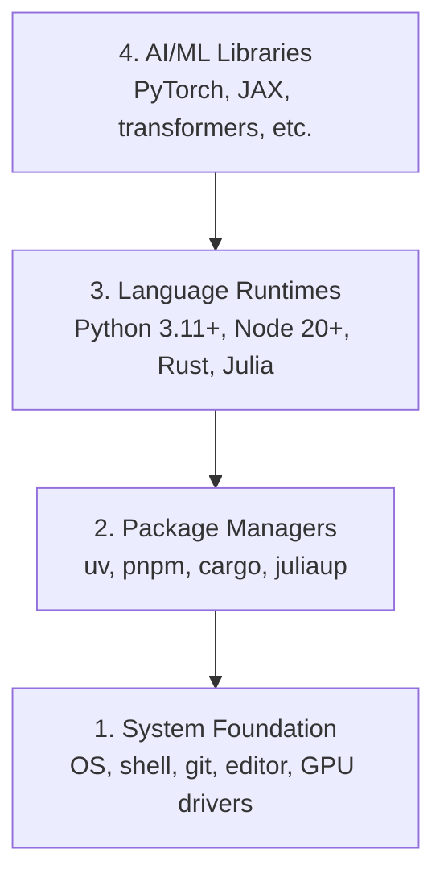

# 开发环境

> 工具会塑造你的思考。装一次，装对。

**Type:** Build
**Languages:** Python, Node.js, Rust
**Prerequisites:** None
**Time:** ~45 minutes

## 学习目标

- 从零搭好 Python 3.11+、Node.js 20+、Rust 工具链
- 配好虚拟环境和包管理器，保证可复现
- 验证 GPU（CUDA / MPS）并跑一次张量运算
- 理解四层栈：系统、包管理器、语言运行时、AI 库

## 问题

接下来 500 多课要用 Python、TypeScript、Rust、Julia。环境一坏，每一课都在跟工具打架，而不是在学。

多数人跳过环境配置，然后把时间耗在 import 报错、版本冲突、找不到 CUDA 上。我们做一次，做对。

## 概念

AI 工程环境有四层，从下往上装，上一层依赖下一层：



```figure
s0-env-stack
```

## 从零实现

### 第 1 步：系统层

检查系统，装上基础工具。

```bash
# macOS
xcode-select --install
brew install git curl wget

# Ubuntu/Debian
sudo apt update && sudo apt install -y build-essential git curl wget

# Windows (use WSL2)
wsl --install -d Ubuntu-24.04
```

### 第 2 步：用 uv 装 Python

`uv` 比 pip 快 10–100 倍，并且自动处理虚拟环境。

```bash
curl -LsSf https://astral.sh/uv/install.sh | sh

uv python install 3.12

uv venv
source .venv/bin/activate  # Windows: .venv\Scripts\activate

uv pip install numpy matplotlib jupyter
```

验证：

```python
import sys
print(f"Python {sys.version}")

import numpy as np
print(f"NumPy {np.__version__}")
a = np.array([1, 2, 3])
print(f"Vector: {a}, dot product with itself: {np.dot(a, a)}")
```

### 第 3 步：用 pnpm 装 Node.js

给 TypeScript 课用（agents、MCP、web）。

```bash
curl -fsSL https://fnm.vercel.app/install | bash
fnm install 22
fnm use 22

npm install -g pnpm

node -e "console.log('Node', process.version)"
```

**macOS / Apple Silicon：** 若安装停在 `Error: Cannot install under Rosetta 2...`，说明终端跑在 Rosetta 下。按官方英文课文用 `arch -arm64 brew install fnm` 处理。

### 第 4 步：Rust

给偏性能的课（推理、系统）。

```bash
curl --proto '=https' --tlsv1.2 -sSf https://sh.rustup.rs | sh

rustc --version
cargo --version
```

### 第 5 步：Julia（可选）

数学课里 Julia 会更顺。

```bash
curl -fsSL https://install.julialang.org | sh

julia -e 'println("Julia ", VERSION)'
```

### 第 6 步：有 GPU 再装

**NVIDIA（Linux / Windows）：**

```bash
nvidia-smi

uv pip install torch torchvision torchaudio --index-url https://download.pytorch.org/whl/cu124
```

**macOS / Apple Silicon：** 没有 CUDA，这是正常的。不要加 `cuXXX` 的 index。普通安装即可，里面带 MPS。

验证（任意平台）：

```python
import torch
print(f"CUDA available: {torch.cuda.is_available()}")
print(f"MPS available:  {torch.backends.mps.is_available()}")
if torch.cuda.is_available():
    print(f"GPU: {torch.cuda.get_device_name(0)}")
```

没有 GPU 也可以。多数课能在 CPU 上跑。训练很重的课再用 Colab 或云 GPU。

### 第 7 步：按你要走的路线做预检

所有命令从仓库根目录跑（有 `README.md` 和 `phases/` 的那一层）。

完整入门路线：

```bash
python phases/00-setup-and-tooling/01-dev-environment/code/verify.py --route beginner
```

也可只检某一条路线：`ml-foundations` / `llm-engineering` / `agents` / `mcp` / `agent-skills` / `certification`。

加 `--show-later` 会检查以后才用到的工具；缺它们不会挡住当前路线。

入门预检通过后会打印下一课命令：

```text
Ready to start Beginner course.
Next: python3 phases/01-math-foundations/01-linear-algebra-intuition/code/vectors.py
```

Windows 上若 `python3` 不存在，用 `python`。

## 用生产工具

环境通过后，缺什么再装什么，不必一次装完全栈。

| 语言 | 用在哪 | 包管理器 |
|------|--------|----------|
| Python | Phases 1-12 | uv |
| TypeScript | Phases 13-17 | pnpm |
| Rust | Phases 12, 15-17 | cargo |
| Julia | Phase 1 | Pkg |

## 产出

- 官方：`outputs/prompt-env-check.md`（环境诊断提示词，不要改）
- 本课对照：`learning-artifacts/cn/phases/00-setup-and-tooling/01-dev-environment/docs/cn.md`

## 练习

1. 跑验证脚本，修好失败项
2. 为本课建 Python 虚拟环境并安装 PyTorch
3. 用四种语言各写一个 hello world 并运行
