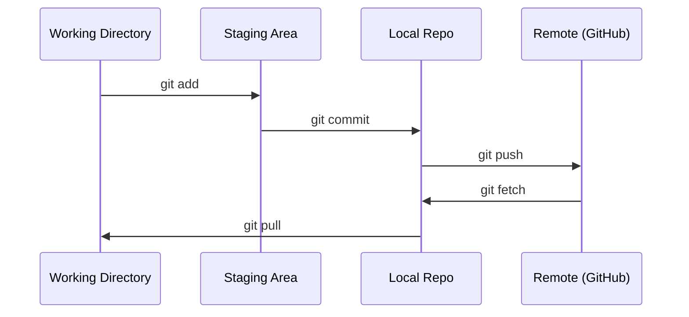

# Git 与协作

> 版本控制不是可选项。这里的每一次实验、每一个模型、每一课，都要被记下。

**Type:** Learn
**Languages:** --
**Prerequisites:** Phase 0, Lesson 01
**Time:** ~30 minutes

## 学习目标

- 配置 git 身份，会用日常的 add、commit、push
- 为实验建分支、合并，不把 main 搞坏
- 写一份 `.gitignore`，把模型权重和大二进制文件排除在外
- 用 `git log` 看提交历史，理解项目怎么演进

## 问题

后面 20 个阶段你会写下几百个文件。没有版本控制，就会丢工作、改坏却回不去，也无法和别人协作。

Git 是工具。GitHub 是代码托管的地方。这一课只讲这门课用得到的部分。

## 概念



记住三件事：

1. 经常保存（`git commit`）
2. 推到远端（`git push`）
3. 实验用分支（`git checkout -b experiment`）

```figure
s0-commit-dag
```

## 从零实现

### 第 1 步：配置 git

```bash
git config --global user.name "Your Name"
git config --global user.email "you@example.com"
```

### 第 2 步：日常流程

```bash
git status
git add file.py
git commit -m "Add perceptron implementation"
git push origin main
```

### 第 3 步：用分支做实验

```bash
git checkout -b experiment/new-optimizer

# ... 改代码、commit ...

git checkout main
git merge experiment/new-optimizer
```

### 第 4 步：和本课程仓库一起工作

你不能往课程官方仓库推送，只有维护者有写权限。先在 GitHub 上 Fork（右上角 Fork），让 `origin` 指向**你自己的副本**：

```bash
git clone https://github.com/YOUR-USERNAME/ai-engineering-from-scratch.git
cd ai-engineering-from-scratch

git checkout -b my-progress
# 上课、提交你的代码
git push origin my-progress
```

## 用生产工具

这门课你只需要这些命令：

| 命令 | 什么时候用 |
|------|------------|
| `git clone` | 拿到课程仓库 |
| `git add` + `git commit` | 保存你的工作 |
| `git push` | 备份到 GitHub |
| `git checkout -b` | 试东西，不弄坏 main |
| `git log --oneline` | 看自己做过什么 |

到此为止。这门课不需要 rebase、cherry-pick、submodule。

## 练习

1. Fork 本仓库，克隆你的 fork，建分支 `my-progress`，加一个文件，commit，push
2. 写一份 `.gitignore`，排除模型权重（`.pt`、`.pth`、`.safetensors`）
3. 用 `git log --oneline` 看本仓库历史，读读课是怎么加进去的

## 关键术语

| 术语 | 人们常说 | 实际含义 |
|------|----------|----------|
| Commit | 「保存」 | 整个项目在某一时刻的快照 |
| Branch | 「一份拷贝」 | 指向某次 commit 的指针，你工作它就往前走 |
| Merge | 「把代码合在一起」 | 把一个分支上的改动接到另一个分支 |
| Remote | 「云上」 | 仓库在别处的一份拷贝（GitHub、GitLab） |
