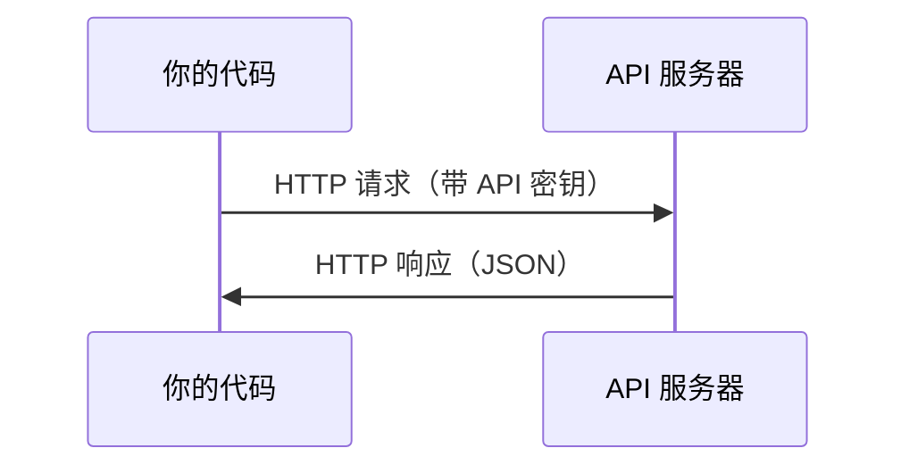

# API 与密钥

> 所有 AI API 都是同一件事：发请求，收回响应。细节会变，模式不变。

**Type:** Build
**Languages:** Python, TypeScript
**Prerequisites:** Phase 0, Lesson 01
**Time:** ~30 minutes

## 学习目标

- 用环境变量和 `.env` 文件安全存放 API 密钥
- 分别用 Anthropic Python SDK 和裸 HTTP 调一次 LLM
- 对比 SDK 和裸 HTTP 的请求/响应，方便排错
- 识别并处理常见 API 错误：鉴权失败、速率限制

## 问题

从 Phase 11 起要调 LLM API（Anthropic、OpenAI、Google）。Phase 13–16 会在循环里反复调。你需要知道密钥是什么、怎么安全存放、怎么打出第一次请求。

## 概念



每次 API 调用都有：

1. 端点（URL）
2. API 密钥（鉴权）
3. 请求体（你要什么）
4. 响应体（你得到什么）

```figure
s0-secret-inject
```

## 从零实现

### 第 1 步：安全存放密钥

密钥不要写进代码。用环境变量。

```bash
export ANTHROPIC_API_KEY="sk-ant-..."
export OPENAI_API_KEY="sk-..."
```

或用 `.env` 文件（加入 `.gitignore`）：

```
ANTHROPIC_API_KEY=sk-ant-...
OPENAI_API_KEY=sk-...
```

### 第 2 步：第一次调用（Python）

```python
import os

import anthropic

client = anthropic.Anthropic()

MODEL = os.environ.get("LLM_MODEL", "claude-sonnet-5")

response = client.messages.create(
    model=MODEL,
    max_tokens=256,
    messages=[{"role": "user", "content": "What is a neural network in one sentence?"}]
)

print(response.content[0].text)
```

`LLM_MODEL` 选 Anthropic 的模型 id，默认是不带日期的 Sonnet 别名。OpenAI、Google 等也是「一把密钥 + 一个模型 id」，但 SDK、端点和报文格式各不相同。

### 第 3 步：第一次调用（TypeScript）

```typescript
import Anthropic from "@anthropic-ai/sdk";

const client = new Anthropic();

const MODEL = process.env.LLM_MODEL ?? "claude-sonnet-5";

const response = await client.messages.create({
  model: MODEL,
  max_tokens: 256,
  messages: [{ role: "user", content: "What is a neural network in one sentence?" }],
});

console.log(response.content[0].text);
```

### 第 4 步：裸 HTTP（不用 SDK）

```python
import os
import urllib.request
import json

url = "https://api.anthropic.com/v1/messages"
headers = {
    "Content-Type": "application/json",
    "x-api-key": os.environ["ANTHROPIC_API_KEY"],
    "anthropic-version": "2023-06-01",
}
body = json.dumps({
    "model": os.environ.get("LLM_MODEL", "claude-sonnet-5"),
    "max_tokens": 256,
    "messages": [{"role": "user", "content": "What is a neural network in one sentence?"}],
}).encode()

req = urllib.request.Request(url, data=body, headers=headers, method="POST")
with urllib.request.urlopen(req) as resp:
    result = json.loads(resp.read())
    print(result["content"][0]["text"])
```

SDK 底层就是这个。看懂裸 HTTP，排错才不瞎。

## 用生产工具

这门课里：

| API | 什么时候用 | 免费档 |
|-----|------------|--------|
| Anthropic (Claude) | Phases 11–16（agent、工具） | 注册约有 $5 额度 |
| OpenAI | Phase 11（对比） | 注册约有 $5 额度 |
| Hugging Face | Phases 4–10（模型、数据集） | 免费 |

现在不必全开。哪一课要用再配哪一把。

## 产出

- 官方：`outputs/prompt-api-troubleshooter.md`（排 API 错，不要改）
- 本课对照：`learning-artifacts/cn/phases/00-setup-and-tooling/04-apis-and-keys/docs/cn.md`

## 练习

1. 申请一把 Anthropic API key，打出第一次调用
2. 跑裸 HTTP 版，对比 SDK 的响应格式
3. 故意用错密钥，读报错信息

## 关键术语

| 术语 | 人们常说 | 实际含义 |
|------|----------|----------|
| API key | 「API 的密码」 | 标识你的账户、授权请求的一串字符 |
| Rate limit | 「被限流了」 | 每分钟/每小时最多请求次数，防止滥用 |
| Token | 「一个词」（在 API 语境） | 计费单位：输入和输出 token 分开计数、分开收费 |
| Streaming | 「实时回复」 | 一个字一个字返回，而不是等整段结束 |
