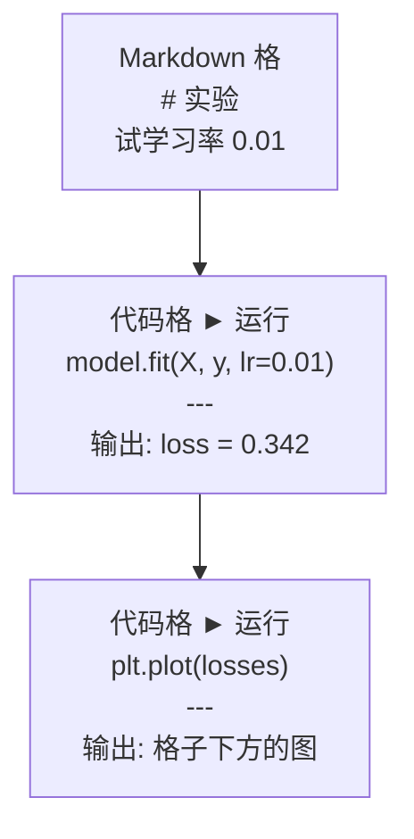
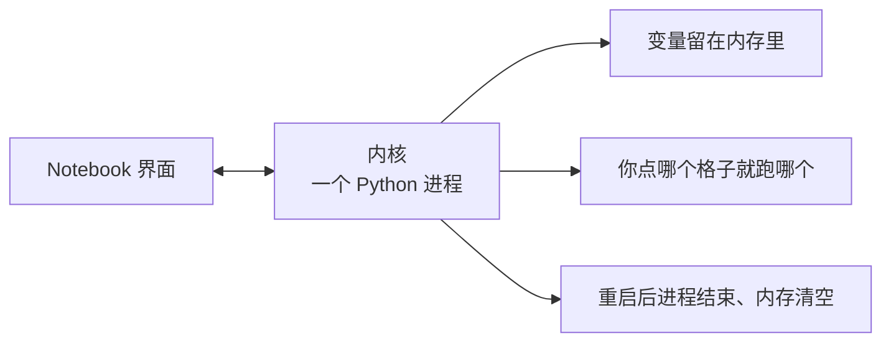

# Jupyter Notebooks

> Notebook 是 AI 工程的实验台。在这里试，试通了再搬进生产。

**Type:** Build
**Languages:** Python
**Prerequisites:** Phase 0, Lesson 01
**Time:** ~30 minutes

## 学习目标

- 安装并启动 JupyterLab、Jupyter Notebook，或在 VS Code 里用 Jupyter 扩展
- 用 magic（`%timeit`、`%%time`、`%matplotlib inline`）做计时和内嵌绘图
- 分清何时用 notebook、何时用脚本，走「explore in notebooks, ship in scripts」
- 避开常见坑：乱序执行、隐藏状态、内存泄漏

## 问题

AI 论文、教程、Kaggle 都用 Jupyter。代码可以一块块跑、结果就在下面、文字和公式夹在中间。不用 notebook 学 AI，像做数学作业不打草稿。

但 notebook 也有真坑。什么都往里面塞会把自己绕死。什么时候用 notebook、什么时候用 `.py`，后面会省很多调试时间。

## 概念

Notebook 是一串格子（cell）。格子要么是代码，要么是文字。



内核（kernel）是后台的一个 Python 进程。你点运行，格子里的代码发给内核，内核算完把结果送回来。所有格子共用同一个内核，所以变量会在格子之间留下来。



「你点哪个就跑哪个」既是超能力，也是踩雷点。

```figure
s0-cell-order
```

## 从零实现

### 第 1 步：选界面

三种界面，一种文件格式：

| 界面 | 安装 | 最适合 |
|------|------|--------|
| JupyterLab | `pip install jupyterlab` 然后 `jupyter lab` | 完整 IDE：多标签、文件树、终端 |
| Jupyter Notebook | `pip install notebook` 然后 `jupyter notebook` | 轻量，一次一本 |
| VS Code | 装 Jupyter 扩展 | 已在编辑器里，带 git 和调试 |

三者读写同一份 `.ipynb`。AI 工作里 JupyterLab 最常见。

```bash
pip install jupyterlab
jupyter lab
```

### 第 2 步：真正常用的快捷键

两种模式。`Esc` 进入命令模式（左侧蓝条），`Enter` 进入编辑模式（绿条）。

**命令模式（最常用）：**

| 键 | 作用 |
|----|------|
| `Shift+Enter` | 运行当前格，跳到下一格 |
| `A` | 在上方插入格子 |
| `B` | 在下方插入格子 |
| `DD` | 删除格子 |
| `M` | 变成 Markdown |
| `Y` | 变成代码 |
| `Z` | 撤销格子操作 |
| `Ctrl+Shift+H` | 显示全部快捷键 |

**编辑模式：**

| 键 | 作用 |
|----|------|
| `Tab` | 补全 |
| `Shift+Tab` | 显示函数签名 |
| `Ctrl+/` | 切换注释 |

`Shift+Enter` 一天要按上千次，先记它。

### 第 3 步：格子类型

**代码格**跑 Python 并显示输出：

```python
import numpy as np
data = np.random.randn(1000)
data.mean(), data.std()
```

输出：`(0.0032, 0.9987)`

**Markdown 格**渲染排版文字，用来写你在做什么、为什么。支持标题、加粗、斜体、LaTeX（`$E = mc^2$`）、表格、图片。

### 第 4 步：Magic 命令

这不是 Python，是 Jupyter 专用命令。`%` 管一行（line magic），`%%` 管一格（cell magic）。

**计时：**

```python
%timeit np.random.randn(10000)
```

输出：`45.2 us +/- 1.3 us per loop`

```python
%%time
model.fit(X_train, y_train, epochs=10)
```

输出：`Wall time: 2.34 s`

`%timeit` 跑很多次再取平均。`%%time` 只跑一次。微基准用 `%timeit`，训练用 `%%time`。

**内嵌绘图：**

```python
%matplotlib inline
```

之后每次 `plt.plot()` 或 `plt.show()` 都画在格子下面。

**不离开 notebook 装包：**

```python
!pip install scikit-learn
```

`!` 前缀会跑任意 shell 命令。

**看环境变量：**

```python
%env CUDA_VISIBLE_DEVICES
```

### 第 5 步：在格子里显示富内容

Notebook 会自动显示格子里最后一个表达式。你也可以自己控制：

```python
import pandas as pd

df = pd.DataFrame({
    "model": ["Linear", "Random Forest", "Neural Net"],
    "accuracy": [0.72, 0.89, 0.94],
    "training_time": [0.1, 2.3, 45.6]
})
df
```

这会渲染成 HTML 表，不是纯文本。图也一样：

```python
import matplotlib.pyplot as plt

plt.figure(figsize=(8, 4))
plt.plot([1, 2, 3, 4], [1, 4, 2, 3])
plt.title("Inline Plot")
plt.show()
```

图出现在格子正下方。数据和代码、图在一起，这是 notebook 主导 AI 实验的原因。

图片：

```python
from IPython.display import Image, display
display(Image(filename="architecture.png"))
```

### 第 6 步：Google Colab

Colab 是云上的免费 Jupyter，带 GPU、预装库、Google Drive。不用本机配置。

1. 打开 [colab.research.google.com](https://colab.research.google.com)
2. 上传本课任意 `.ipynb`
3. Runtime > Change runtime type > T4 GPU（免费）

和本地 Jupyter 的差别：

- 两次会话之间文件不保留（存 Drive 或下载）
- 预装：numpy、pandas、matplotlib、torch、tensorflow、sklearn
- `from google.colab import files` 上传/下载
- `from google.colab import drive; drive.mount('/content/drive')` 做持久存储
- 免费档闲置约 90 分钟会断

## 用生产工具

### Notebook vs 脚本：什么时候用哪个

| 用 notebook | 用脚本 |
|-------------|--------|
| 探索数据集 | 训练流水线 |
| 原型模型 | 可复用工具函数 |
| 看结果、画图 | 带 `if __name__` 的入口 |
| 讲解你的工作 | 定时跑的代码 |
| 快速实验 | 生产代码 |
| 课内练习 | 要发布的包和库 |

规则：**explore in notebooks, ship in scripts。**

AI 里常见流程：

1. 在 notebook 里看数据
2. 在 notebook 里试模型
3. 试通了，搬进 `.py`
4. 再在 notebook 里 `import` 那些 `.py` 继续实验

### 常见坑

**乱序执行。** 先跑第 5 格，再跑第 2 格，再跑第 7 格。你机器上能跑，别人从上到下就挂。修法：分享前 Kernel > Restart & Run All。

**隐藏状态。** 格子删了，它创建的变量还在内存里。看起来干净，其实依赖「鬼格子」。修法：经常重启内核。

**内存泄漏。** 载入 4GB 数据、训练、再载入另一份，什么都没释放。修法：`del variable_name` 和 `gc.collect()`，或重启内核。

## 产出

- 官方：`outputs/prompt-notebook-helper.md`（排 notebook 的错，不要改官方那份）
- 对照：`learning-artifacts/cn/phases/00-setup-and-tooling/05-jupyter-notebooks/`

## 练习

1. 打开 JupyterLab，建 notebook，用 `%timeit` 对比列表推导和 NumPy 生成 100,000 个随机数
2. 做一本既有 Markdown 又有代码的 notebook：读 CSV、显示 dataframe、画图。然后 Kernel > Restart & Run All，确认从上到下能跑通
3. 把 `code/notebook_tips.py` 贴进 Colab，用免费 GPU 跑一遍

## 关键术语

| 术语 | 人们常说 | 实际含义 |
|------|----------|----------|
| Kernel | 「跑我代码的那个东西」 | 单独的 Python 进程，执行格子并在内存里留变量 |
| Cell | 「一块代码」 | notebook 里可独立运行的一格，代码或 Markdown |
| Magic command | 「Jupyter 的把戏」 | 以 `%` 或 `%%` 开头、控制 notebook 环境的命令 |
| `.ipynb` | 「notebook 文件」 | 含格子、输出和元数据的 JSON。IPython Notebook 的缩写 |

## 延伸阅读

- [JupyterLab 文档](https://jupyterlab.readthedocs.io/)
- [Google Colab FAQ](https://research.google.com/colaboratory/faq.html)
- [28 Jupyter Notebook Tips](https://www.dataquest.io/blog/jupyter-notebook-tips-tricks-shortcuts/)
