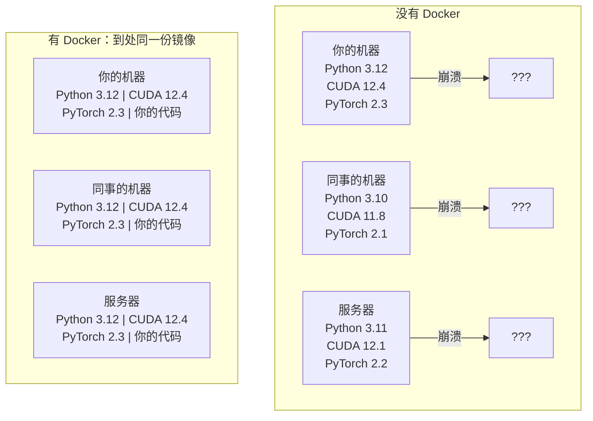

# Docker 与 AI

> 容器让「在我机器上能跑」成为过去式。

**Type:** Build
**Languages:** Docker
**Prerequisites:** Phase 0, Lessons 01 和 03
**Time:** ~60 minutes

## 学习目标

- 用 Dockerfile 构建带 CUDA、PyTorch 和 AI 库的 GPU 镜像
- 用 volume 挂载宿主机目录，让模型、数据集和代码在容器重建后还在
- 配置 NVIDIA Container Toolkit，让容器里能用到 GPU
- 用 Docker Compose 编排多服务 AI 应用（推理服务 + 向量库）

## 问题

你在笔记本上用 PyTorch 2.3、CUDA 12.4、Python 3.12 训好模型。同事是 PyTorch 2.1、CUDA 11.8、Python 3.10。模型在他机器上崩溃。Dockerfile 在两边都能跑。

AI 项目的依赖是噩梦：Python、PyTorch、CUDA 驱动、cuDNN、系统级 C 库，还有 flash-attn 这种需要精确编译器版本的包。Docker 把这些打进一份镜像，到处跑起来都一样。

## 概念

Docker 把代码、运行时、库和系统工具包成一个隔离单元，叫做**容器（container）**。可以想成轻量虚拟机，但它**共享宿主机的操作系统内核**，而不是再跑一套自己的内核，所以几秒就能启动，不用等几分钟。



### 为什么 AI 项目比一般项目更需要 Docker

1. **GPU 驱动很脆。** CUDA 12.4 的代码不能在 CUDA 11.8 上跑。Docker 把 CUDA toolkit（编译和运行 CUDA 程序的那套库）隔离在容器里，同时通过 NVIDIA Container Toolkit 共享**宿主机上的 GPU 驱动**。
2. **模型权重大。** 70 亿参数的模型用 fp16 大约 14 GB。你不会希望每次重建镜像都重新下载。Docker 的 volume 可以把宿主机上的 models 目录挂进容器。
3. **多服务架构很常见。** 真正的 AI 应用不只是一个 Python 脚本。它是推理服务器、给 RAG 用的向量数据库，也许还有网页前端。Docker Compose 用一条命令编排这些服务。

### 关键词汇

| 术语 | 含义 |
|------|------|
| Image（镜像） | 只读模板。你的菜谱。由 Dockerfile 构建出来。 |
| Container（容器） | 镜像的一次运行实例。你的厨房。 |
| Dockerfile | 一层层构建镜像的说明书。 |
| Volume | 容器重启之后还在的持久存储。 |
| docker-compose | 用 YAML 定义「多个容器怎么一起跑」的工具。 |

### AI 里常见的容器形态

```
开发容器（Dev Container）
  全家桶。编辑器支持。Jupyter。调试工具。
  用在开发和实验阶段。

训练容器（Training Container）
  尽量瘦。只有训练脚本和依赖。
  跑在 GPU 集群上。不要编辑器，不要 Jupyter。

推理容器（Inference Container）
  为提供服务而优化。镜像小。冷启动快。
  生产环境里放在负载均衡后面。
```

```figure
s0-image-layers
```

## 从零实现

### 第 1 步：安装 Docker

```bash
# macOS
brew install --cask docker
open /Applications/Docker.app

# Ubuntu
curl -fsSL https://get.docker.com | sh
sudo usermod -aG docker $USER
# 改组之后要注销再登录才生效
```

验证：

```bash
docker --version
docker run hello-world
```

（你已经用 Docker Desktop 的 WSL 集成做完这一步。）

### 第 2 步：安装 NVIDIA Container Toolkit（有 NVIDIA GPU 的 Linux）

这让 Docker 容器能访问 GPU。macOS 和 Windows（WSL2）可以先跳过；那些平台上 Docker Desktop 用另一套方式做 GPU 透传。

```bash
distribution=$(. /etc/os-release;echo $ID$VERSION_ID)
curl -fsSL https://nvidia.github.io/libnvidia-container/gpgkey | sudo gpg --dearmor -o /usr/share/keyrings/nvidia-container-toolkit-keyring.gpg
curl -s -L https://nvidia.github.io/libnvidia-container/$distribution/libnvidia-container.list | \
    sed 's#deb https://#deb [signed-by=/usr/share/keyrings/nvidia-container-toolkit-keyring.gpg] https://#g' | \
    sudo tee /etc/apt/sources.list.d/nvidia-container-toolkit.list

sudo apt-get update
sudo apt-get install -y nvidia-container-toolkit
sudo nvidia-ctk runtime configure --runtime=docker
sudo systemctl restart docker
```

在容器里测试 GPU：

```bash
docker run --rm --gpus all nvidia/cuda:12.4.1-base-ubuntu22.04 nvidia-smi
```

若能看到 GPU 信息，toolkit 就工作了。

### 第 3 步：搞懂基础镜像

选对基础镜像能省掉几小时调试。

```
nvidia/cuda:12.4.1-devel-ubuntu22.04
  完整 CUDA toolkit。带编译器。
  用于：构建需要 nvcc 的包（flash-attn、bitsandbytes）
  体积：约 4 GB

nvidia/cuda:12.4.1-runtime-ubuntu22.04
  只有 CUDA 运行时。没有编译器。
  用于：运行已经编好的代码
  体积：约 1.5 GB

pytorch/pytorch:2.6.0-cuda12.4-cudnn9-runtime
  在 CUDA 之上预装了 PyTorch。
  用于：跳过自己装 PyTorch
  体积：约 6 GB

python:3.12-slim
  没有 CUDA。仅 CPU。
  用于：CPU 推理、轻量工具
  体积：约 150 MB
```

### 第 4 步：写一份 AI 开发用的 Dockerfile

`code/Dockerfile` 里就是这一份。逐段看：

```dockerfile
FROM nvidia/cuda:12.4.1-devel-ubuntu22.04

ENV DEBIAN_FRONTEND=noninteractive
ENV PYTHONUNBUFFERED=1

RUN apt-get update && apt-get install -y --no-install-recommends \
    software-properties-common \
    git \
    curl \
    build-essential \
    && add-apt-repository -y ppa:deadsnakes/ppa \
    && apt-get update && apt-get install -y --no-install-recommends \
    python3.12 \
    python3.12-venv \
    python3.12-dev \
    && rm -rf /var/lib/apt/lists/*

RUN update-alternatives --install /usr/bin/python python /usr/bin/python3.12 1

RUN curl -sSL https://raw.githubusercontent.com/pypa/get-pip/3b73145063be545b649ad9ca83ea8da5fc915a4f/public/get-pip.py -o /tmp/get-pip.py \
    && echo "a341e1a43e38001c551a1508a73ff23636a11970b61d901d9a1cad2a18f57055  /tmp/get-pip.py" | sha256sum -c - \
    && python /tmp/get-pip.py \
    && rm /tmp/get-pip.py \
    && update-alternatives --install /usr/bin/pip pip /usr/local/bin/pip3.12 1

RUN python -m pip install --no-cache-dir --upgrade pip setuptools wheel

RUN python -m pip install --no-cache-dir \
    torch==2.6.0+cu124 \
    torchvision==0.21.0+cu124 \
    torchaudio==2.6.0+cu124 \
    --index-url https://download.pytorch.org/whl/cu124

RUN python -m pip install --no-cache-dir \
    numpy \
    pandas \
    scikit-learn \
    matplotlib \
    jupyter \
    transformers \
    datasets \
    accelerate \
    safetensors

WORKDIR /workspace

VOLUME ["/workspace", "/models"]

EXPOSE 8888

CMD ["python"]
```

构建：

```bash
docker build -t ai-dev -f phases/00-setup-and-tooling/07-docker-for-ai/code/Dockerfile .
```

第一次会比较久（下载 CUDA 基础镜像 + PyTorch）。之后的构建会用缓存层。

运行：

```bash
docker run --rm -it --gpus all \
    -v $(pwd):/workspace \
    -v ~/models:/models \
    ai-dev python -c "import torch; print(f'PyTorch {torch.__version__}, CUDA: {torch.cuda.is_available()}')"
```

在容器里跑 Jupyter：

```bash
docker run --rm -it --gpus all \
    -v $(pwd):/workspace \
    -v ~/models:/models \
    -p 8888:8888 \
    ai-dev jupyter notebook --ip=0.0.0.0 --port=8888 --no-browser --allow-root
```

### 第 5 步：用 volume 挂数据和模型

AI 工作里 volume 几乎是必须的。没有它，容器一停，你下的 14 GB 模型就没了。

```bash
# 挂你的代码
-v $(pwd):/workspace

# 挂一份共享的模型目录
-v ~/models:/models

# 挂数据集
-v ~/datasets:/data
```

训练脚本里从挂载路径加载：

```python
from transformers import AutoModel

model = AutoModel.from_pretrained("/models/llama-7b")
```

模型在宿主机磁盘上。容器怎么重建都不用重新下载。

### 第 6 步：用 Docker Compose 跑多服务 AI

真正的 RAG 需要推理服务和向量库。Docker Compose 一条命令把两者拉起来。

见 `code/docker-compose.yml`：

```yaml
services:
  ai-dev:
    build:
      context: .
      dockerfile: Dockerfile
    deploy:
      resources:
        reservations:
          devices:
            - driver: nvidia
              count: all
              capabilities: [gpu]
    volumes:
      - ../../../:/workspace
      - ~/models:/models
      - ~/datasets:/data
    ports:
      - "8888:8888"
    stdin_open: true
    tty: true
    command: jupyter notebook --ip=0.0.0.0 --port=8888 --no-browser --allow-root

  qdrant:
    image: qdrant/qdrant:v1.12.5
    ports:
      - "6333:6333"
      - "6334:6334"
    volumes:
      - qdrant_data:/qdrant/storage

volumes:
  qdrant_data:
```

启动全部：

```bash
cd phases/00-setup-and-tooling/07-docker-for-ai/code
docker compose up -d
```

之后 AI 开发容器可以用服务名访问向量库：`http://qdrant:6333`。Compose 会自动建共享网络。

在 AI 容器里测连通：

```python
from qdrant_client import QdrantClient

client = QdrantClient(host="qdrant", port=6333)
print(client.get_collections())
```

停掉全部：

```bash
docker compose down
```

加上 `-v` 会连 Qdrant 的 volume 一起删：

```bash
docker compose down -v
```

### 第 7 步：AI 工作里常用的 Docker 命令

```bash
# 列出正在运行的容器
docker ps

# 列出所有镜像和体积
docker images

# 删掉没用的镜像（回收磁盘）
docker system prune -a

# 在已经运行的容器里看 GPU
docker exec -it <container_id> nvidia-smi

# 从容器拷文件到宿主机
docker cp <container_id>:/workspace/results.csv ./results.csv

# 看容器日志
docker logs -f <container_id>
```

## 用生产工具

你现在有一套可复现的 AI 开发环境。这门课后面可以：

- 用 `docker compose up` 同时拉起开发环境和向量库
- 把代码、模型、数据挂成 volume，重建不会丢
- 某课需要新的 Python 包时，写进 Dockerfile 再重建
- 把 Dockerfile 发给同事，他们得到同一套环境

### 没有 GPU？

去掉 `--gpus all` 和 NVIDIA 的 deploy 块。容器对 CPU 课仍然可用。PyTorch 发现没有 CUDA 会自动退回 CPU。

## 练习

1. 构建这份 Dockerfile，在容器里跑 `python -c "import torch; print(torch.__version__)"`
2. 启动 docker-compose，确认从 AI 容器能访问 `http://qdrant:6333/collections`
3. 在 Dockerfile 里加上 `flask`，重建，在 5000 端口跑一个简单 API，用 `-p 5000:5000` 映射端口
4. 用 `docker images` 看镜像体积。把基础镜像从 `devel` 换成 `runtime`，比较体积

## 关键术语

| 术语 | 人们常说 | 实际含义 |
|------|----------|----------|
| Container | 「轻量虚拟机」 | 使用宿主机内核的隔离进程，有自己的文件系统和网络 |
| Image layer | 「缓存的一步」 | Dockerfile 每条指令生成一层。没改的层会缓存，重建才快 |
| NVIDIA Container Toolkit | 「Docker 里的 GPU」 | 运行时钩子，用 `--gpus` 把宿主机 GPU 暴露给容器 |
| Volume mount | 「共享文件夹」 | 宿主机目录映射进容器。容器停了，改动还在 |
| Base image | 「起点」 | Dockerfile 的 `FROM`。决定预装了什么 |
