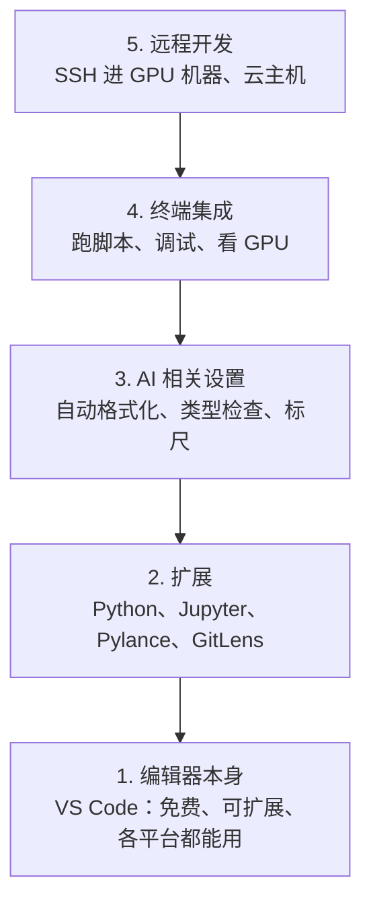

# 编辑器配置

> 编辑器是副驾驶。配一次，让它别挡路，并开始干活。

**Type:** Build
**Languages:** --
**Prerequisites:** Phase 0, Lesson 01
**Time:** ~20 minutes

## 学习目标

- 安装 VS Code，并装上 Python、Jupyter、检查、远程 SSH 所需的扩展
- 配好保存时格式化、类型检查、notebook 输出滚动，适合 AI 工作流
- 用 Remote SSH 在远程 GPU 机器上编辑和调试，就像在本机一样
- 比较 Cursor、Windsurf、Neovim，知道各自对 AI 工作的取舍

## 问题

你会在编辑器里花掉几千小时：写 Python、跑 notebook、调试训练循环、SSH 进 GPU 机器。编辑器没配好，每次都是阻力：没有补全、没有类型提示、没有行内报错、手调格式、终端别扭。

配好大约 20 分钟。跳过它，以后每天都要再付这 20 分钟。

## 概念

AI 工程用的编辑器需要五层，从下往上：



```figure
s0-lsp-roundtrip
```

## 从零实现

### 第 1 步：安装 VS Code

推荐 VS Code。免费，各系统都能跑，Jupyter 是一等公民，扩展覆盖 AI 工作需要的东西。

从 [code.visualstudio.com](https://code.visualstudio.com/) 下载。

在终端验证：

```bash
code --version
```

macOS 上如果找不到 `code`：打开 VS Code，`Cmd+Shift+P`，输入 Shell Command，选 Install 'code' command in PATH。

### 第 2 步：安装必要扩展

在 VS Code 集成终端（各平台都是 `` Ctrl+` ``）里安装：

```bash
code --install-extension ms-python.python
code --install-extension ms-python.vscode-pylance
code --install-extension ms-toolsai.jupyter
code --install-extension eamodio.gitlens
code --install-extension ms-vscode-remote.remote-ssh
code --install-extension ms-python.debugpy
code --install-extension ms-python.black-formatter
code --install-extension charliermarsh.ruff
```

| 扩展 | 为什么要它 |
|------|------------|
| Python | 语言支持、发现虚拟环境、运行和调试 |
| Pylance | 类型检查、补全、解析 import |
| Jupyter | 在 VS Code 里跑 notebook，看变量 |
| GitLens | 谁改了哪一行，行内 git blame |
| Remote SSH | 把远程 GPU 机器上的文件夹当成本地打开 |
| Debugpy | Python 单步调试 |
| Black Formatter | 保存时自动格式化，风格一致 |
| Ruff | 很快的检查器，抓住常见错误 |

本课 `code/.vscode/extensions.json` 是推荐列表。打开项目文件夹时，VS Code 会提示安装。

### 第 3 步：配置

可以把本课 `code/.vscode/settings.json` 抄进你的设置，或 `设置 > 打开设置 JSON` 里手写。

AI 工作最要紧的几项：

```jsonc
{
    "python.analysis.typeCheckingMode": "basic",
    "editor.formatOnSave": true,
    "editor.rulers": [88, 120],
    "notebook.output.scrolling": true,
    "files.autoSave": "afterDelay"
}
```

- **类型检查 basic**：参数类型不对就标出来，不必先跑。张量形状、API 参数错了，能在编辑时看见。
- **保存时格式化**：不用再手调空格。Black 负责。
- **标尺 88 和 120**：Black 在 88 列折行。120 用来提醒文档字符串和注释太长。
- **Notebook 输出滚动**：训练循环会刷几千行。不滚动的话，输出区会撑爆。
- **自动保存**：忘了保存就去跑，跑的是旧代码。自动保存避免这件事。

### 第 4 步：终端

集成终端用来跑训练、看 GPU、管环境。

```jsonc
{
    "terminal.integrated.defaultProfile.linux": "bash",
    "terminal.integrated.fontSize": 13,
    "terminal.integrated.scrollback": 10000
}
```

| 动作 | Linux / Windows |
|------|-----------------|
| 打开/关掉终端 | `` Ctrl+` `` |
| 新终端 | `` Ctrl+Shift+` `` |
| 拆分终端 | `Ctrl+Shift+5` |

拆成两块很有用：一块跑脚本，一块 `nvidia-smi -l 1` 或 `watch -n 1 nvidia-smi` 看 GPU。

### 第 5 步：Remote SSH（进 GPU 机器）

这是 AI 工作里最重要的扩展之一。训练常在远程机器上（云主机、实验室服务器）。Remote SSH 让你打开远程文件系统、改文件、开终端、调试，好像文件就在本机。

1. 装好 Remote SSH（第 2 步）。
2. `Ctrl+Shift+P`，输入 Remote-SSH: Connect to Host。
3. 填 `user@你的GPU机器地址`。
4. VS Code 会在远程自动装一个轻量服务端。

免密：

```bash
ssh-keygen -t ed25519 -C "your-email@example.com"
ssh-copy-id user@你的GPU机器地址
```

写进 `~/.ssh/config`：

```
Host gpu-box
    HostName 203.0.113.50
    User ubuntu
    IdentityFile ~/.ssh/id_ed25519
    ForwardAgent yes
```

之后 `Remote-SSH: Connect to Host > gpu-box` 就能连。你已经有 `Host gpu` 指向 `gpu3`，用的是同一件事。

## 其他编辑器

### Cursor

[cursor.com](https://cursor.com) 是带 AI 补全的 VS Code 分支。扩展和设置格式一样。用 Cursor 的话，本课的 `settings.json` 和 `extensions.json` 仍然适用。

### Windsurf

[windsurf.com](https://windsurf.com) 也是 AI 向的 VS Code 分支。扩展、设置、Remote SSH 同样能用。

### Vim / Neovim

你已经用得很顺，就留在那里。AI Python 至少要：pyright 或 pylsp、nvim-lspconfig、notebook 插件、搜索、black/ruff。还不会 Vim 就不要现在学，学习曲线会和学 AI 抢时间。用 VS Code。

## 用生产工具

配好之后每天是：

1. 用 VS Code 打开项目，或 Remote SSH 连上 GPU 机器。
2. 写 Python 时有补全、类型、行内报错。
3. 用 Jupyter 扩展在编辑器里跑 notebook。
4. 集成终端里跑训练、`uv pip install`、看 GPU。
5. 提交前用 GitLens 看改了什么。

## 练习

1. 安装 VS Code，并装上第 2 步列出的扩展
2. 把本课的 `settings.json` 抄进 VS Code 配置
3. 打开一个 Python 文件，确认 Pylance 有类型提示，保存时 Black 会格式化
4. 如果有远程机器，配好 Remote SSH 并打开上面的一个文件夹

## 关键术语

| 术语 | 人们常说 | 实际含义 |
|------|----------|----------|
| LSP | 「补全引擎」 | Language Server Protocol：编辑器向语言服务器要类型、补全、诊断的标准协议 |
| Pylance | 「Python 插件」 | 微软的 Python 语言服务，用 Pyright 做类型检查和 IntelliSense |
| Remote SSH | 「在服务器上干活」 | 在远程机器上跑一个轻量服务端，把界面串回你本机的编辑器 |
| Format on save | 「自动美化」 | 每次保存都跑 Black 或 Ruff，风格始终一致 |
