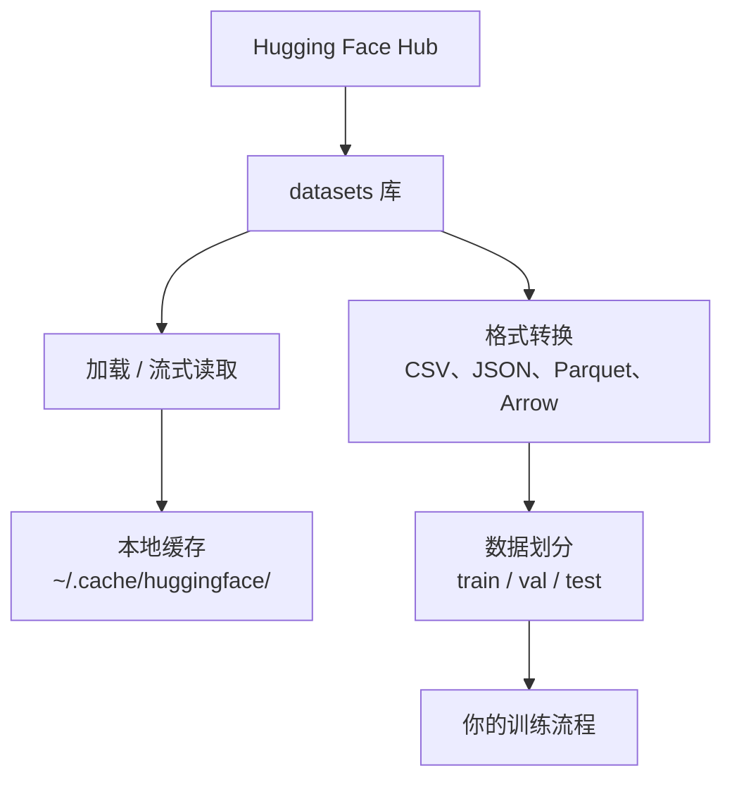

# 数据管理

> 数据是燃料。你怎么管它，决定你走得有多快。

**Type:** Build
**Language:** Python
**Prerequisites:** Phase 0, Lesson 01
**Time:** ~45 minutes

## 学习目标

- 用 Hugging Face 的 `datasets` 库加载、流式读取并缓存数据集
- 在 CSV、JSON、Parquet、Arrow 之间转换，并说明各自的取舍
- 用固定随机种子做可复现的训练 / 验证 / 测试划分
- 用 `.gitignore`、Git LFS 或 DVC 管理大模型和大数据文件

## 问题

每个 AI 项目都从数据开始。你要找到数据集、下载、换格式、分成训练和评估用的几份，还要给数据做版本，实验才能复现。每次都手工做，又慢又容易错。你需要一套能重复的流程。

## 概念



Hugging Face 的 `datasets` 库是 AI 工作里加载数据的标准方式。下载、缓存、换格式、流式读取，它都包好了。

```figure
s0-data-pipeline
```

## 从零实现

### 第 1 步：安装 datasets 库

```bash
pip install datasets huggingface_hub
```

### 第 2 步：加载一个数据集

```python
from datasets import load_dataset

dataset = load_dataset("stanfordnlp/imdb")
print(dataset)
print(dataset["train"][0])
```

这会下载 IMDB 影评数据集。第一次下载之后，以后从缓存读：`~/.cache/huggingface/datasets/`。

### 第 3 步：流式读取很大的数据集

有的数据集大到磁盘放不下。流式读取一行一行来，不把整份下完。

```python
dataset = load_dataset("wikimedia/wikipedia", "20220301.en", split="train", streaming=True)

for i, example in enumerate(dataset):
    print(example["title"])
    if i >= 4:
        break
```

流式模式给你一个 `IterableDataset`。数据到达才处理。数据集再大，内存占用也大致不变。

### 第 4 步：数据格式

`datasets` 内部用 Apache Arrow。可以按流水线需要转成别的格式。

```python
dataset = load_dataset("stanfordnlp/imdb", split="train")

dataset.to_csv("imdb_train.csv")
dataset.to_json("imdb_train.json")
dataset.to_parquet("imdb_train.parquet")
```

| 格式 | 体积 | 读取速度 | 适合 |
|------|------|----------|------|
| CSV | 大 | 慢 | 人能读、表格软件 |
| JSON | 大 | 慢 | API、嵌套数据 |
| Parquet | 小 | 快 | 分析、按列查询 |
| Arrow | 小 | 最快 | 内存里处理（`datasets` 内部用的） |

AI 工作里，存盘优先 Parquet。内存里用 Arrow。CSV 和 JSON 用来交换。

### 第 5 步：数据划分

每个机器学习项目需要三份：

- **Train（训练）**：模型从这里学，通常约 80%
- **Validation（验证）**：训练过程中看进展、调超参，通常约 10%
- **Test（测试）**：训练结束后的最终评估，通常约 10%。这批数据训练时不能看

有的数据集已经分好。没有的话自己分：

```python
dataset = load_dataset("stanfordnlp/imdb", split="train")

split = dataset.train_test_split(test_size=0.2, seed=42)
train_val = split["train"].train_test_split(test_size=0.125, seed=42)

train_ds = train_val["train"]
val_ds = train_val["test"]
test_ds = split["test"]

print(f"Train: {len(train_ds)}, Val: {len(val_ds)}, Test: {len(test_ds)}")
```

一定要设 `seed`。同一个种子，每次划分结果相同，实验才能复现。

### 第 6 步：下载并缓存模型

模型文件很大。`huggingface_hub` 负责下载和缓存。

```python
from huggingface_hub import hf_hub_download, snapshot_download

model_path = hf_hub_download(
    repo_id="sentence-transformers/all-MiniLM-L6-v2",
    filename="config.json"
)
print(f"Cached at: {model_path}")

model_dir = snapshot_download("sentence-transformers/all-MiniLM-L6-v2")
print(f"Full model at: {model_dir}")
```

模型缓存在 `~/.cache/huggingface/hub/`。下过一次，下次立刻从本地读。

### 第 7 步：处理大文件

模型权重和大数据集不要进 git。三条路：

**办法 A：`.gitignore`（最简单）**

```
*.bin
*.safetensors
*.pt
*.onnx
data/*.parquet
data/*.csv
models/
```

**办法 B：Git LFS（大文件仍由 git 跟踪）**

```bash
git lfs install
git lfs track "*.bin"
git lfs track "*.safetensors"
git add .gitattributes
```

Git LFS 在仓库里放指针，真正的文件在另一台服务器上。GitHub 免费额度大约 1 GB。

**办法 C：DVC（数据版本控制）**

```bash
pip install dvc
dvc init
dvc add data/training_set.parquet
git add data/training_set.parquet.dvc data/.gitignore
git commit -m "Track training data with DVC"
```

DVC 生成很小的 `.dvc` 文件，指向数据。数据本身在 S3、GCS 或其他远端存储。

| 办法 | 复杂度 | 适合 |
|------|--------|------|
| .gitignore | 低 | 个人项目、能重新下载的数据 |
| Git LFS | 中 | 团队通过 git 共享模型权重 |
| DVC | 高 | 要跨机器复现实验、大数据集、团队 |

这门课用 `.gitignore` 就够。需要在多台机器上复现同一份数据时再用 DVC。

### 第 8 步：存储方式

**本地**适合大约 10 GB 以内。Hugging Face 缓存会自动放在本地。

**云存储**适合更大、或多台机器共享：

```python
import os

local_path = os.path.expanduser("~/.cache/huggingface/datasets/")

# s3_path = "s3://my-bucket/datasets/"
# gcs_path = "gs://my-bucket/datasets/"
```

DVC 可以直接对接 S3 和 GCS：

```bash
dvc remote add -d myremote s3://my-bucket/dvc-store
dvc push
```

这门课用本地存储就够。在远程 GPU 上做微调、数据要共享时，再考虑云存储。

## 这门课会用到的数据集

| 数据集 | 用在哪些课 | 大小 | 教什么 |
|--------|------------|------|--------|
| IMDB | 分词、分类 | 84 MB | 文本分类基础 |
| WikiText | 语言建模 | 181 MB | 预测下一个 token |
| SQuAD | 问答 | 35 MB | 问答、答案片段 |
| Common Crawl（子集） | 向量 | 不定 | 大规模文本 |
| MNIST | 视觉基础 | 21 MB | 图像分类基础 |
| COCO（子集） | 多模态 | 不定 | 图文对 |

现在不用全部下载。每一课会写它需要哪一份。

## 用生产工具

跑工具脚本，确认整条流程能走通：

```bash
python code/data_utils.py
```

它会下载一个小数据集，做转换、划分，并打印摘要。

## 产出

- `code/data_utils.py`：可复用的加载和缓存工具
- `outputs/prompt-data-helper.md`：帮你为任务找数据集的提示词

## 练习

1. 加载 `glue` 数据集的 `mrpc` 配置，看前 5 条
2. 流式读取 `c4`，数 10 秒里能处理多少条
3. 把一份数据转成 Parquet，和 CSV 比文件大小
4. 用固定种子做 70/15/15 的 train/val/test，核对条数

## 关键术语

| 术语 | 人们常说 | 实际含义 |
|------|----------|----------|
| Dataset split | 「训练数据」 | 命名好的子集（train/val/test），用在机器学习的不同阶段 |
| Streaming | 「懒加载」 | 从远端一行一行读，不把整份数据集下到磁盘 |
| Parquet | 「压缩过的 CSV」 | 按列存的二进制格式，适合分析查询，也更省空间 |
| Arrow | 「很快的表」 | 内存里的列式格式。`datasets` 用它做少拷贝的读取 |
| Git LFS | 「大文件版 git」 | 大文件放在仓库外面，仓库里只留指针 |
| DVC | 「数据版 git」 | 给数据集和模型做版本，并接到云存储 |
| Cache | 「已经下过了」 | 以前下载的本地副本。默认在 `~/.cache/huggingface/` |
