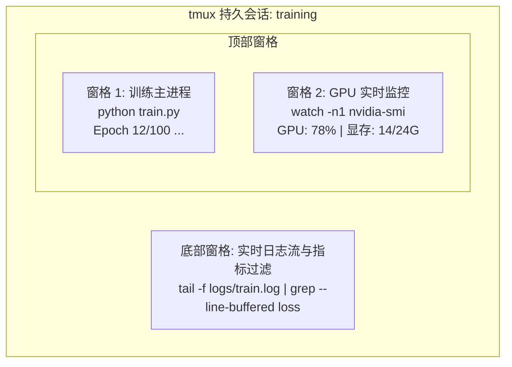

# 终端与 Shell

> 终端是 AI 工程师安身立命的地方。必须在这里游刃有余。

**Type:** Learn  
**Languages:** --  
**Prerequisites:** Phase 0, Lesson 01  
**Time:** ~35 minutes  

## 学习目标

- 使用管道（Piping）、重定向（Redirects）和 `grep` 在命令行中过滤并处理训练日志
- 创建具有多窗格（Panes）的持久化 tmux 会话，支持模型训练与 GPU 硬件监控并发运行
- 使用 `htop`、`nvtop` 和 `nvidia-smi` 实时监控系统 CPU、内存与 GPU 显存
- 使用 SSH、`scp` 和 `rsync` 在本地机器与远程 GPU 服务器之间安全高效地传输文件

## 痛点与背景

你在终端里花的时间，往往会远超过在任何图形化编辑器（IDE）里的时间。模型训练、GPU 显存排查、实时日志追踪、远程 SSH 登录调试、Python 虚拟环境切换——每一个 AI 工程工作流的核心步骤都发生在 Shell 之中。如果在终端层面操作迟滞，整个研发循环的迭代效率就会大打折扣。

本课聚焦于深度学习与 AI 研发中真正高频的核心终端技能：不讲晦涩的 Unix 远古历史，不做冗长抽象的 Bash 语法推演，直击 AI 工程师每日必用的实战命令。

## 核心架构与概念



如上图所示：**一个终端窗口，三个独立任务并发运行**。更重要的是，你可以随时从这个会话脱离（Detach），哪怕断开 SSH、合上电脑回家，远程服务器上的训练任务依然在后台平稳运行；再次连接时，只需重新附加（Attach）即可无缝恢复现场。

```figure
s0-shell-pipeline
```

---

## 动手构建与逐步实战

### 第 1 步：认清你的 Shell 环境

首先查看当前使用的 Shell 解释器：

```bash
echo $SHELL
```

主流 Linux / macOS 发行版大多使用 `/bin/bash` 或 `/bin/zsh`。两者均能完美适配本课程所有命令。

日常必备的核心快捷操作：

```bash
# 路径移动与查看
cd ~/ai-engineering-from-scratch
pwd
ls -la

# 历史命令反向搜索（最实用的快捷键）
# 按 Ctrl+R，然后输入曾经敲过的命令片段
# 多次按 Ctrl+R 可向上循环匹配更早的记录

# 清理终端屏幕
clear   # 或者直接按 Ctrl+L

# 终止当前正在运行的前台命令（发送 SIGINT 信号）
# Ctrl+C

# 挂起当前运行的前台任务到后台（发送 SIGTSTP 信号，后续可用 fg 恢复）
# Ctrl+Z
```

---

### 第 2 步：文件描述符、管道与重定向

管道（Pipe）与重定向是 Unix 哲学的精髓：把小而专的工具组合起来处理复杂的日志和数据流。

```bash
# 统计日志中 "loss" 出现的总次数
cat train.log | grep "loss" | wc -l

# 从训练日志中提取纯 loss 数值并重定向写入文件
grep "loss:" train.log | awk '{print $NF}' > losses.txt

# 实时监听日志更新，并只显示包含 ERROR 的行（注意必须加 --line-buffered 防止缓冲区延迟）
tail -f train.log | grep --line-buffered "ERROR"

# 按最终准确率对多组实验结果从高到低排序
grep "final_accuracy" results/*.log | sort -t= -k2 -n -r

# 将标准输出 (stdout) 和标准错误 (stderr) 分别写入不同文件
python train.py > output.log 2> errors.log

# 将标准输出和标准错误合并写入同一个日志文件（生产最常用）
python train.py > train_full.log 2>&1
```

**重定向符号对照表：**

| 符号 | 作用 | 底层语义 |
|------|------|----------|
| `>` | 覆盖写入标准输出（stdout）到文件 | 描述符 1 指向新文件（截断） |
| `>>` | 追加写入标准输出（stdout）到文件 | 描述符 1 指向文件末尾（追加） |
| `2>` | 覆盖写入标准错误（stderr）到文件 | 描述符 2 指向新文件 |
| `2>&1` | 将标准错误合并到标准输出的目标通道 | 复制描述符 1 到描述符 2（`dup2`） |
| `\|` | 将前一个命令的 stdout 连到后一个命令的 stdin | 匿名管道（Anonymous Pipe） |

> **关键陷阱解析**：为什么必须写成 `> train.log 2>&1`，而不能写成 `2>&1 > train.log`？  
> Shell 从左向右解析重定向：如果先写 `2>&1`，此时描述符 1 还在屏幕上，描述符 2 会被定向到屏幕；紧接着 `> train.log` 只把描述符 1 换到了文件。结果会导致错误信息依然漏打在终端上！

---

### 第 3 步：后台进程管理与防挂断（SIGHUP）

大模型或神经网络训练动辄数小时甚至数天，绝不能将终端死死锁在前台：

```bash
# 简单的后台执行（末尾加 &，但终端关闭时依然可能被 SIGHUP 信号杀死）
python train.py &

# 忽略挂断信号，并重定向所有输出（即使关掉终端或断网，进程仍继续跑）
nohup python train.py > train.log 2>&1 &

# 查看当前终端的后台任务列表
jobs

# 依据名字查找系统中运行的训练进程
ps aux | grep train.py

# 将编号为 1 的后台任务拉回前台
fg %1

# 杀死指定任务编号的后台任务
kill %1

# 或者通过进程名匹配一次性杀死
kill $(pgrep -f "train.py")
```

**三种后台方案能力对比：**

| 方式 | 终端关闭后能否存活？ | 能否重新接入交互（Reattach）？ |
|------|--------------------|-----------------------------|
| `command &` | 否（默认随会话退出） | 否 |
| `nohup command &` | 是（忽略 SIGHUP） | 否（只能靠读日志文件观察） |
| `screen` / `tmux` | 是（会话独立于 TTY） | **是（随时完整恢复窗格与输出）** |

---

### 第 4 步：tmux —— AI 工程师必备终端多路复用器

`tmux` 能让你在一个终端中切分多个窗格，更核心的是它的**服务端-客户端架构**：进程运行在 tmux 服务端守护进程中，本地断网脱离（Detach）完全不影响任务执行。

```bash
# 启动一个具名会话（推荐规范命名）
tmux new -s training

# 水平切分窗格（上下分屏）
# 快捷键：Ctrl+B 然后按 "

# 垂直切分窗格（左右分屏）
# 快捷键：Ctrl+B 然后按 %

# 在窗格之间跳转
# 快捷键：Ctrl+B 然后按 方向键（上/下/左/右）

# 脱离会话（会话及内部程序继续在后台奔跑）
# 快捷键：Ctrl+B 然后按 d

# 重新连接（附加）到已有会话
tmux attach -t training

# 查看所有活跃的 tmux 会话
tmux ls

# 结束并销毁整个会话
tmux kill-session -t training
```

**AI 训练典型三窗格布局模板：**
```bash
tmux new -s train
# 窗格 1：主训练命令
python train.py --epochs 100 --lr 1e-4

# 按 Ctrl+B 然后按 " 上下切分，在下方启动 GPU 监控
watch -n1 nvidia-smi

# 按 Ctrl+B 然后按 % 左右切分下方窗格，用于实时过滤 Loss
tail -f logs/experiment.log | grep --line-buffered "loss"

# 按 Ctrl+B 然后按 d 脱离会话，安心断开 SSH
```

---

### 第 5 步：系统资源与显存监控（htop、nvtop、nvidia-smi）

```bash
# 查看 CPU 与内存进程详情（比传统的 top 直观且支持交互）
htop

# 查看 GPU 计算利用率及显存图形化走势（需单独安装 nvtop）
nvtop

# 快速查看 NVIDIA GPU 状态（单次快照）
nvidia-smi

# 每秒自动刷新一次 GPU 状态（最常见排查方法）
watch -n1 nvidia-smi

# 精准查询当前占用 GPU 显存的计算进程与 PID（排查显存泄漏 OOM 必备）
nvidia-smi --query-compute-apps=pid,name,used_memory --format=csv
```

**htop 核心交互键：**
- `F6` 或 `>`：按列排序（按 MEM% 排序找出内存泄漏进程）。
- `F5`：切换为进程树状视图（观察 DataLoader 多进程 worker 分支）。
- `F9`：向选中进程发送终止信号（如 SIGTERM 或 SIGKILL 强制杀进程）。
- `/`：按进程名搜索过滤。

---

### 第 6 步：远程 GPU 服务器 SSH 运维与端口转发

在租用云端 GPU（如 Lambda, RunPod, Vast.ai）或登录实验室 A100 服务器时，SSH 是唯一通路：

```bash
# 基础密码或默认密钥登录
ssh user@gpu-box-ip

# 指定专用私钥登录
ssh -i ~/.ssh/my_gpu_key user@gpu-box-ip

# 传输单文件到远程
scp model.pt user@gpu-box-ip:~/models/

# 从远程下载单文件
scp user@gpu-box-ip:~/results/metrics.json ./

# 目录同步（断点续传、校验增量，远比 scp 稳定高效）
rsync -avzP ./data/ user@gpu-box-ip:~/data/

# 本地端口转发（Local Port Forwarding）：在本地直接访问远程 Jupyter 或 TensorBoard
ssh -L 8888:localhost:8888 user@gpu-box-ip
# 执行后，直接在本地浏览器打开 http://localhost:8888 即可访问远端服务
```

---

### 第 7 步：提升效能的常用 Shell 别名（Aliases）

可将课程提供的通用别名脚本引入你的 `~/.bashrc` 或 `~/.zshrc`：

```bash
source ~/ai-engineering-from-scratch/phases/00-setup-and-tooling/10-terminal-and-shell/code/shell_aliases.sh
```

核心别名速查：
- `gpu`：单行紧凑输出 GPU 型号、利用率、显存使用及温度。
- `killtraining`：一键清理所有匹配 `python.*train` 的训练进程。
- `ae`：快速激活当前项目的 `.venv` 虚拟环境。
- `watchloss`：实时过滤追踪 `logs/*.log` 中的 loss 字段。

---

### 第 8 步：工业界高频实用命令套路

```bash
# 训练输出同时在屏幕打印并落盘（利用 tee）
python train.py 2>&1 | tee train.log

# 进程替换对比两次实验指标差异
diff <(grep "accuracy" exp1.log) <(grep "accuracy" exp2.log)

# 寻找磁盘上占用体积前 20 的大模型权重文件（排查磁盘暴满）
find . -name "*.pt" -o -name "*.safetensors" | xargs du -h | sort -rh | head -20

# 统计项目所有 Python 源码总行数
find . -name "*.py" | xargs wc -l | tail -1

# 训练前检查环境变量是否正确识别到了 CUDA
env | grep -i cuda
```

---

## 生产实践对照表（Use It）

| 工具 | 工业界核心使用场景 |
|------|-------------------|
| `tmux` | 任何大于 5 分钟的训练、微调任务必用，保证会话独立与多屏并查 |
| `tail -f` + `grep` | 训练过程指标监控、异常堆栈实时报警 |
| `nohup` / `&` | 短平快的轻量级后台离线任务 |
| `htop` / `nvtop` | 排查 CPU DataLoader 瓶颈（CPU 利用率拉不满）与 GPU 显存泄漏（OOM） |
| `SSH -L` 端口转发 | 本地浏览器直连云端无公网 Web 服务的 TensorBoard / WandB / Jupyter |
| `rsync` | 海量数据集与权重断点续传同步 |

---

## 课后实操练习

1. 在 WSL 中安装并启动 `tmux`，切分出 3 个窗格，分别运行状态监控、命令交互与 Python 测试；练习 Detach 脱离和 Attach 恢复。
2. 将 `shell_aliases.sh` 中的常用别名引入到你的 `~/.bashrc` 并使其生效。
3. 生成一段模拟训练日志流，通过管道与 `awk`、`grep` 准确抽取出指定 step 的 loss 曲线数据。
4. 验证重定向 `> log 2>&1` 与管道 `--line-buffered` 的缓冲区别。

---

## 核心术语表（Key Terms）

| 术语 | 俗称 | 底层计算机科学定义 |
|------|------|-------------------|
| **Shell** | 终端命令行 | 负责解释并执行用户指令的操作环境程序（bash, zsh 等） |
| **tmux** | 终端复用器 | 运行在后台的服务端程序，管理多个伪终端（PTY）并在单一 TTY 上复用显示 |
| **Pipe (`\|`)** | 管道 | 操作系统内核提供的单向字节流 IPC 缓冲区，将前进程的 stdout 连至后进程的 stdin |
| **PID** | 进程号 | 内核进程控制块（PCB）的唯一整数标识符，用于调度与信号通信 |
| **SIGHUP** | 挂断信号 | 当控制终端（TTY）关闭时，内核发送给该会话所有前台进程的 1 号信号，默认动作终止进程 |
| **nohup** | 防挂断包装器 | 截获并忽略 SIGHUP 信号，使得子进程在父终端退出后依然能存活 |
