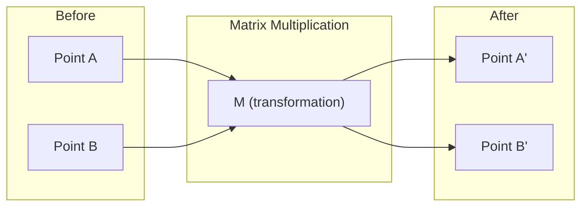
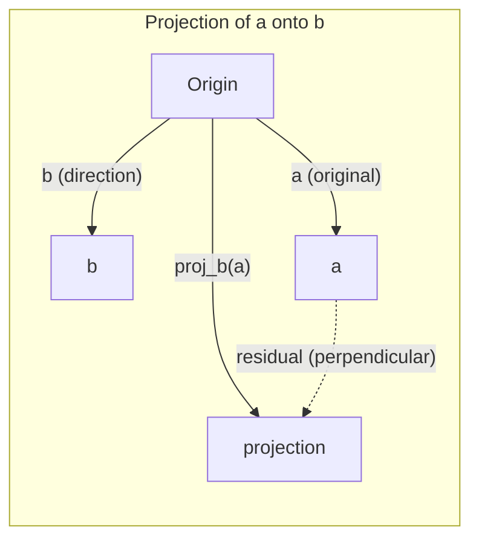

# 线性代数直觉

> 每个 AI 模型，本质上都是穿着漂亮帽子的矩阵运算。

**Type:** Learn
**Languages:** Python, Julia
**Prerequisites:** Phase 0
**Time:** ~60 minutes

## 学习目标

- 用 Python 从零实现向量和矩阵运算（加法、点积、矩阵乘法）
- 从几何上说明点积（dot product）、投影（projection）和 Gram-Schmidt 过程在做什么
- 用行化简判断一组向量的线性无关（linear independence）、秩（rank）和基（basis）
- 把这些概念接到 AI 里的用法：embedding、attention scores、LoRA

## 问题

打开任意一篇机器学习论文，第一页几乎都会出现向量、矩阵、点积和变换。没有线性代数直觉时，它们只是符号；有了直觉，你才能看见神经网络实际在做的事——在空间里搬动一些点。

你不需要成为数学家。你需要看见这些运算的几何含义，然后自己把它们写成代码。

## 概念

### 向量是点（也是方向）

向量就是一列数。但这些数有含义：它们是空间里的坐标。

**二维向量 [3, 2]：**

| x | y | 点 |
|---|---|----|
| 3 | 2 | 这个向量从原点 (0,0) 指向平面上的 (3, 2) |

它的长度（magnitude）是 sqrt(3^2 + 2^2) = sqrt(13)，方向朝右上方。

在 AI 里，向量可以表示几乎所有东西：

- 一个词 → 768 个数组成的向量（它在 embedding 空间里的「含义」）
- 一张图 → 数百万像素值组成的向量
- 一个用户 → 一串偏好数字组成的向量

### 矩阵是变换

矩阵把一个向量变成另一个向量。它可以旋转、缩放、拉伸或投影。



在 AI 里，矩阵就是模型本身：

- 神经网络的 weights → 把输入变成输出的矩阵
- attention scores → 决定「看哪里」的矩阵
- embeddings → 把词映射成向量的矩阵

### 点积衡量相似度

两个向量的点积告诉你它们有多相似。

```
a · b = a₁×b₁ + a₂×b₂ + ... + aₙ×bₙ

同向:      a · b > 0  (相似)
垂直:      a · b = 0  (无关)
反向:      a · b < 0  (不相似)
```

搜索引擎、推荐系统和 RAG 字面意义上就是在找点积高的向量。

### 线性无关

一组向量线性无关，意思是：集合里没有任何一个向量能写成其余向量的组合。如果 v1、v2、v3 无关，它们张成三维空间；如果其中一个是另外两个的组合，它们只张成一个平面。

对 AI 为什么重要：特征矩阵的各列应当线性无关。如果两个特征完全相关（线性相关），模型分不清它们各自的作用。这会在回归里造成多重共线性——权重矩阵变得不稳定，输入的微小变化会让输出剧烈摆动。

**具体例子：**

```
v1 = [1, 0, 0]
v2 = [0, 1, 0]
v3 = [2, 1, 0]   # v3 = 2*v1 + v2
```

v1 和 v2 无关——谁也不是对方的倍数或组合。但 v3 = 2*v1 + v2，所以 {v1, v2, v3} 是相关组。这三个向量都躺在 xy 平面上。无论怎么组合，都到不了 [0, 0, 1]。你有三个向量，却只有两个自由度。

在数据集里：如果 feature_3 = 2*feature_1 + feature_2，再加入 feature_3 不会给模型任何新信息。更糟的是，法方程会变成奇异的——权重没有唯一解。

### 基与秩

基（basis）是能张成整个空间的、数量最少的线性无关向量。基向量的个数就是这个空间的维数。

三维空间的标准基是 {[1,0,0], [0,1,0], [0,0,1]}。但三维里任意三个无关向量都是合法的基。选哪一组基，就是选哪一套坐标系。

矩阵的秩（rank）= 线性无关列的个数 = 线性无关行的个数。如果 rank < min(行数, 列数)，矩阵亏秩（rank-deficient）。这意味着：

- 方程组有无穷多解（或无解）
- 变换会丢掉信息
- 矩阵不可逆

| 情况 | 秩 | 对机器学习的含义 |
|------|----|------------------|
| 满秩（rank = min(m, n)） | 尽可能大 | 存在唯一的最小二乘解。模型条件良好。 |
| 亏秩（rank < min(m, n)） | 低于最大可能 | 特征冗余。权重有无穷多解。需要正则化。 |
| 秩为 1 | 1 | 每一列都是同一个向量的缩放。全部数据落在一条直线上。 |
| 接近亏秩（奇异值很小） | 数值上偏低 | 矩阵病态。一点点输入噪声就会造成很大输出变化。用 SVD 截断或 ridge regression。 |

### 投影

把向量 **a** 投影到向量 **b** 上，得到 **a** 在 **b** 方向上的分量：

```
proj_b(a) = (a dot b / b dot b) * b
```

残差 (a - proj_b(a)) 垂直于 b。这种正交分解是最小二乘拟合的地基。

投影在机器学习里到处都是：

- 线性回归最小化观测到列空间的距离——解本身就是一次投影
- PCA 把数据投影到方差最大的方向
- Transformer 里的 attention 计算 query 在 key 上的投影



**例子：** a = [3, 4], b = [1, 0]

proj_b(a) = (3*1 + 4*0) / (1*1 + 0*0) * [1, 0] = 3 * [1, 0] = [3, 0]

投影丢掉了 y 分量。这是最简单的降维——扔掉你不关心的方向。

### Gram-Schmidt 过程

把任意一组无关向量变成标准正交基。标准正交（orthonormal）的意思是：每个向量长度为 1，每对向量互相垂直。

算法：

1. 取第一个向量，把它单位化（normalize）
2. 取第二个向量，减去它在第一个上的投影，再单位化
3. 取第三个向量，减去它在前面所有向量上的投影，再单位化
4. 对其余向量重复

```
输入:  v1, v2, v3, ... (线性无关)

u1 = v1 / |v1|

w2 = v2 - (v2 dot u1) * u1
u2 = w2 / |w2|

w3 = v3 - (v3 dot u1) * u1 - (v3 dot u2) * u2
u3 = w3 / |w3|

输出: u1, u2, u3, ... (标准正交基)
```

QR 分解内部就是这样做的。Q 是标准正交基，R 记下投影系数。QR 分解用于：

- 解线性方程组（比高斯消元更稳）
- 算特征值（QR 算法）
- 最小二乘回归（标准数值方法）

```figure
eigen-directions
```

## 从零实现

### 第 1 步：从零写向量（Python）

```python
class Vector:
    def __init__(self, components):
        self.components = list(components)
        self.dim = len(self.components)

    def __add__(self, other):
        return Vector([a + b for a, b in zip(self.components, other.components)])

    def __sub__(self, other):
        return Vector([a - b for a, b in zip(self.components, other.components)])

    def dot(self, other):
        return sum(a * b for a, b in zip(self.components, other.components))

    def magnitude(self):
        return sum(x**2 for x in self.components) ** 0.5

    def normalize(self):
        mag = self.magnitude()
        return Vector([x / mag for x in self.components])

    def cosine_similarity(self, other):
        return self.dot(other) / (self.magnitude() * other.magnitude())

    def __repr__(self):
        return f"Vector({self.components})"


a = Vector([1, 2, 3])
b = Vector([4, 5, 6])

print(f"a + b = {a + b}")
print(f"a · b = {a.dot(b)}")
print(f"|a| = {a.magnitude():.4f}")
print(f"cosine similarity = {a.cosine_similarity(b):.4f}")
```

### 第 2 步：从零写矩阵（Python）

```python
class Matrix:
    def __init__(self, rows):
        self.rows = [list(row) for row in rows]
        self.shape = (len(self.rows), len(self.rows[0]))

    def __matmul__(self, other):
        if isinstance(other, Vector):
            return Vector([
                sum(self.rows[i][j] * other.components[j] for j in range(self.shape[1]))
                for i in range(self.shape[0])
            ])
        rows = []
        for i in range(self.shape[0]):
            row = []
            for j in range(other.shape[1]):
                row.append(sum(
                    self.rows[i][k] * other.rows[k][j]
                    for k in range(self.shape[1])
                ))
            rows.append(row)
        return Matrix(rows)

    def transpose(self):
        return Matrix([
            [self.rows[j][i] for j in range(self.shape[0])]
            for i in range(self.shape[1])
        ])

    def __repr__(self):
        return f"Matrix({self.rows})"


rotation_90 = Matrix([[0, -1], [1, 0]])
point = Vector([3, 1])

rotated = rotation_90 @ point
print(f"Original: {point}")
print(f"Rotated 90°: {rotated}")
```

### 第 3 步：这和 AI 有什么关系

```python
import random

random.seed(42)
weights = Matrix([[random.gauss(0, 0.1) for _ in range(3)] for _ in range(2)])
input_vector = Vector([1.0, 0.5, -0.3])

output = weights @ input_vector
print(f"Input (3D): {input_vector}")
print(f"Output (2D): {output}")
print("This is what a neural network layer does -- matrix multiplication.")
```

### 第 4 步：Julia 版本

```julia
a = [1.0, 2.0, 3.0]
b = [4.0, 5.0, 6.0]

println("a + b = ", a + b)
println("a · b = ", a ⋅ b)       # Julia supports unicode operators
println("|a| = ", √(a ⋅ a))
println("cosine = ", (a ⋅ b) / (√(a ⋅ a) * √(b ⋅ b)))

# Matrix-vector multiplication
W = [0.1 -0.2 0.3; 0.4 0.5 -0.1]
x = [1.0, 0.5, -0.3]
println("Wx = ", W * x)
println("This is a neural network layer.")
```

### 第 5 步：从零写线性无关和投影（Python）

```python
def is_linearly_independent(vectors):
    n = len(vectors)
    dim = len(vectors[0].components)
    mat = Matrix([v.components[:] for v in vectors])
    rows = [row[:] for row in mat.rows]
    rank = 0
    for col in range(dim):
        pivot = None
        for row in range(rank, len(rows)):
            if abs(rows[row][col]) > 1e-10:
                pivot = row
                break
        if pivot is None:
            continue
        rows[rank], rows[pivot] = rows[pivot], rows[rank]
        scale = rows[rank][col]
        rows[rank] = [x / scale for x in rows[rank]]
        for row in range(len(rows)):
            if row != rank and abs(rows[row][col]) > 1e-10:
                factor = rows[row][col]
                rows[row] = [rows[row][j] - factor * rows[rank][j] for j in range(dim)]
        rank += 1
    return rank == n


def project(a, b):
    scalar = a.dot(b) / b.dot(b)
    return Vector([scalar * x for x in b.components])


def gram_schmidt(vectors):
    orthonormal = []
    for v in vectors:
        w = v
        for u in orthonormal:
            proj = project(w, u)
            w = w - proj
        if w.magnitude() < 1e-10:
            continue
        orthonormal.append(w.normalize())
    return orthonormal


v1 = Vector([1, 0, 0])
v2 = Vector([1, 1, 0])
v3 = Vector([1, 1, 1])
basis = gram_schmidt([v1, v2, v3])
for i, u in enumerate(basis):
    print(f"u{i+1} = {u}")
    print(f"  |u{i+1}| = {u.magnitude():.6f}")

print(f"u1 · u2 = {basis[0].dot(basis[1]):.6f}")
print(f"u1 · u3 = {basis[0].dot(basis[2]):.6f}")
print(f"u2 · u3 = {basis[1].dot(basis[2]):.6f}")
```

## 用生产库

下面是用 NumPy 做同一件事——实践中你会用的写法：

```python
import numpy as np

a = np.array([1, 2, 3], dtype=float)
b = np.array([4, 5, 6], dtype=float)

print(f"a + b = {a + b}")
print(f"a · b = {np.dot(a, b)}")
print(f"|a| = {np.linalg.norm(a):.4f}")
print(f"cosine = {np.dot(a, b) / (np.linalg.norm(a) * np.linalg.norm(b)):.4f}")

W = np.random.randn(2, 3) * 0.1
x = np.array([1.0, 0.5, -0.3])
print(f"Wx = {W @ x}")
```

### 用 NumPy 看秩、投影和 QR

```python
import numpy as np

A = np.array([[1, 2], [2, 4]])
print(f"Rank: {np.linalg.matrix_rank(A)}")

a = np.array([3, 4])
b = np.array([1, 0])
proj = (np.dot(a, b) / np.dot(b, b)) * b
print(f"Projection of {a} onto {b}: {proj}")

Q, R = np.linalg.qr(np.random.randn(3, 3))
print(f"Q is orthogonal: {np.allclose(Q @ Q.T, np.eye(3))}")
print(f"R is upper triangular: {np.allclose(R, np.triu(R))}")
```

### PyTorch：张量是带自动求导的向量

```python
import torch

x = torch.randn(3, requires_grad=True)
y = torch.tensor([1.0, 0.0, 0.0])

similarity = torch.dot(x, y)
similarity.backward()

print(f"x = {x.data}")
print(f"y = {y.data}")
print(f"dot product = {similarity.item():.4f}")
print(f"d(dot)/dx = {x.grad}")
```

点积对 x 的梯度就是 y。PyTorch 自动算出来了。神经网络里的每一步都由这类运算构成——矩阵乘、点积、投影——自动求导会穿过它们全部追踪梯度。

你刚刚从零写出了 NumPy 一行能做的事。现在你知道帽子下面是什么了。

## 产出

这一课官方产出：

- `outputs/prompt-linear-algebra-tutor.md` — 让 AI 助手用几何直觉教线性代数的提示词（仓库自带参考，不要改它）

本课学习对照：

- `learning-artifacts/cn/phases/01-math-foundations/01-linear-algebra-intuition/docs/cn.md`

## 和现代 AI 的对应

| 概念 | 出现在哪里 |
|------|------------|
| Dot product | Transformer 的 attention scores，RAG 里的 cosine similarity |
| Matrix multiply | 每一层神经网络，每一次线性变换 |
| Linear independence | 特征选择，避免多重共线性 |
| Rank | 方程组是否可解，LoRA（low-rank adaptation） |
| Projection | 线性回归（投影到列空间），PCA |
| Gram-Schmidt / QR | 数值求解器，特征值计算 |
| Orthonormal basis | 稳定的数值计算，whitening 变换 |

LoRA 值得单独说一句。它微调大语言模型时，把权重更新分解成低秩矩阵。不是去改 4096×4096 的权重（1600 万参数），而是改两个 4096×16 和 16×4096 的矩阵（13.1 万参数）。秩为 16 的约束意味着：LoRA 假定这次更新活在 4096 维空间里一个 16 维的子空间中。这就是线性代数在干实事。

## 练习

1. 实现 `Vector.angle_between(other)`，返回两个向量夹角（度）
2. 做一个二维缩放矩阵：x 变 2 倍、y 变 3 倍，作用在向量 [1, 1] 上
3. 给定 5 个随机的「词向量」（维度 50），用 cosine similarity 找出最相似的一对
4. 验证 Gram-Schmidt 的输出真是标准正交：每对点积为 0，每个长度为 1
5. 做一个秩为 2 的 3×3 矩阵。用 `rank()` 验证。然后说明这些列在几何上张成什么
6. 把 [1, 2, 3] 投影到 [1, 1, 1] 上。结果在几何上代表什么？

## 关键术语

| 术语 | 人们常说 | 实际含义 |
|------|----------|----------|
| Vector | 「一个箭头」 | 一列数，表示 n 维空间里的点或方向 |
| Matrix | 「一张数字表」 | 把向量从一块空间映射到另一块空间的变换 |
| Dot product | 「相乘再相加」 | 两个向量有多同向——相似度搜索的核心 |
| Embedding | 「某种 AI 魔法」 | 表示某物含义的向量（词、图、用户） |
| Linear independence | 「它们不重叠」 | 集合里没有任何一个能写成其余的组合 |
| Rank | 「有多少维」 | 矩阵里线性无关列（或行）的个数 |
| Projection | 「影子」 | 一个向量在另一个向量方向上的分量 |
| Basis | 「坐标轴」 | 能张成空间的、数量最少的无关向量 |
| Orthonormal | 「互相垂直的单位向量」 | 两两垂直，且每个长度为 1 |
